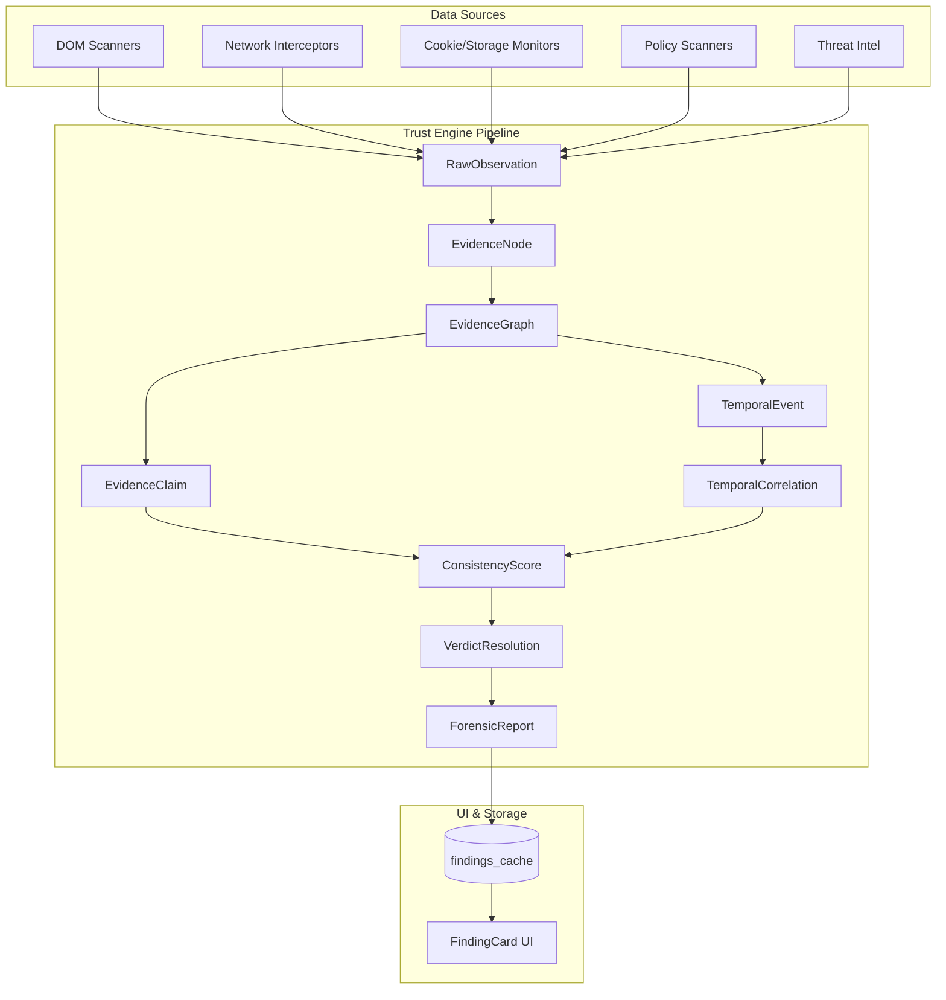

# Vigil System Map

This map outlines the execution contexts and canonical data flow within the Vigil extension. Refer to this before modifying architecture.

## Execution Contexts

- **BACKGROUND (Service Worker)**: Central orchestrator. Hosts the `TrustEngine`, `EvidenceGraph`, state managers, and network interceptors.
- **CONTENT SCRIPT (Isolated World)**: DOM observers, layout shift detectors. Limited permissions. Communicates via message passing.
- **MAIN WORLD (Injected)**: Anti-fingerprinting defenses, prototype pollution detection. Can be spoofed by the page.
- **EXTENSION UI**: The popup/dashboard. Render-only. Reads `ForensicReport` objects from the background.

## Canonical Data Flow

The Trust Engine is the sole path from observation to user-facing finding.

## Architecture & Integration Notes
- **Dual Bridge**: Detectors emit candidate findings which are ingested into the `TrustEngine` via `ObservationFactory.fromLegacyFinding()`. The engine correlates temporal events, resolves claims, and attaches `ForensicReport` objects to `finding.context.trustEngineReport` for complete auditability.
- **MAIN World Defender**: The `defender.js` script is dynamically injected at `document_start` when strict protection is enabled, providing zero-leak prototype camouflage and micro-noise perturbations.

## Immutable Truths

- Scanners do NOT create findings.
- The `EvidenceGraph` is append-only per navigation.
- High confidence cannot override an INELIGIBLE or BLOCKED verdict eligibility.
